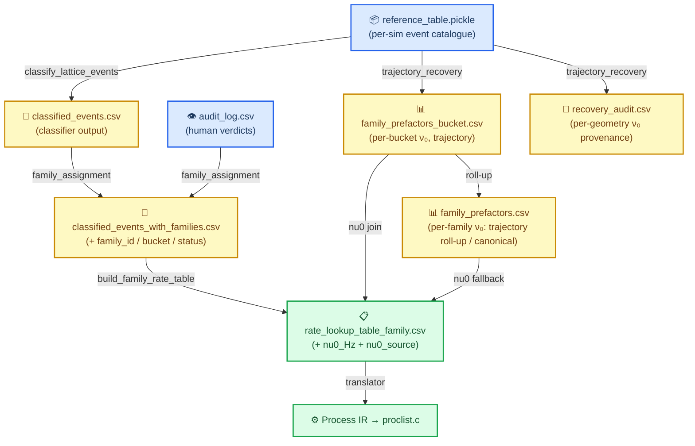

# Catalogue schema — the pyKMC → pylatkmc CSV pipeline

This is the single reference for every CSV that flows from pyKMC simulation output into a
compiled pylatkmc model. Each table lists the file's **producer**, **consumer**, and the
load-bearing columns (type · meaning · provenance). The full chain lives in `pylatkmc.ingest`
(the moved bridge) plus the analysis-side classifier that stays in `apps/PyKMC_Analysis`.

---

## 🔄 Data flow

---

## 📦 `reference_table.pickle`

Per-simulation event catalogue written by pyKMC (`pykmc.event_table.ReferenceEventTable`). One
pickled pandas DataFrame per sim dir. The **local cluster** geometry source for HTST recovery.

| Column | Type | Meaning |
| --- | --- | --- |
| `idx_ref` | int | Unique event id within this sim. Keys the per-step `pykmc.out` `Ref event`. |
| `initial_positions` | (N,3) ndarray | Relaxed **local cluster** at the minimum (rcut subset around the mover; lab-frame-rotated). |
| `saddle_positions` | (N,3) ndarray | Relaxed cluster at the saddle — **same atom order** as `initial_positions`. |
| `final_positions` | (N,3) ndarray | Relaxed cluster at the final state. |
| `initial_types` | (N,) str | Per-atom element symbols (alloy-aware: Ni/Fe/Cr). |
| `move_atom_idx` | int | Index of the moving atom **within the local subset** (not the full system). |
| `energy_barrier` | float | Forward Eₐ (eV) from the pARTn search. |
| `dra` | float | Mover displacement magnitude (Å). |
| `sym_matrix`, `sym_perm`, `idx_backward` | — | Symmetry ops + reverse-event pointer. |

There is **no global atom index and no step pointer** — the cluster is self-contained. HTST ν₀ is
computed directly on it (frozen-boundary partial Hessian); the trajectory provides verification.

---

## 📄 `classified_events.csv` → `classified_events_with_families.csv`

Produced by the analysis classifier (`apps/.../classify_lattice_events`), then annotated with
family assignment by `pylatkmc.ingest.family_assignment` (audit-aware). 65 columns; the
load-bearing groups:

| Column group | Examples | Meaning |
| --- | --- | --- |
| **Identity** | `composition, nvac, temp, sim_path, idx_ref` | Locate the source sim + event (`sim_path`+`idx_ref` resolve back to `reference_table.pickle`). |
| **Energetics** | `energy_barrier, k, reverse_barrier, Ea_gap` | Forward/back barriers, rate. |
| **Geometry** | `move_dist, move_dz, n_moved, mover_depth_initial, surface_layer_initial` | Displacement + depth descriptors used by the classifier. |
| **Environment** | `n_vac_nn1_initial, n_vac_nn2_initial, nn1_count_{Ni,Fe,Cr}, coord_mover_initial` | Vacancy/species counts in the 1NN/2NN shells (drive bucketing). |
| **Classification** | `motif_family_3d, site_class_3d, direction_family_3d` | The classifier's motif/site/direction labels (seed-rule inputs). |
| **Family (assignment)** | `family_id, family_bucket_id, assignment_status, audit_excluded` | Curated family + bucket; `assignment_status ∈ {accepted, excluded, unresolved}`. |

`family_bucket_id` encodes the environment key, e.g. `nv1=2_nv2=0` (2 vacancies in 1NN, 0 in 2NN).
**`representative_row_indices` (in the rate table) are positional `.iloc[]` indices into THIS file.**

---

## 📊 `family_prefactors_bucket.csv` (per-bucket ν₀ — primary)

Produced by `pylatkmc.ingest.trajectory_recovery` (`run_buckets` → `write_outputs`). The
authoritative HTST prefactor source: ν₀ varies strongly across buckets within a family.

| Column | Type | Meaning |
| --- | --- | --- |
| `family_id`, `family_bucket_id` | str | Join key into the rate table. |
| `T_K` | float | Temperature the geometries were tagged at (ν₀ is T-independent; provenance only). |
| `nu0_Hz`, `nu0_THz` | float | Median accepted Vineyard ν₀ over the bucket's representative geometries. |
| `nu0_geomean_Hz` | float | Geometric-mean cross-report. |
| `n_geos_accepted`, `n_geos_attempted` | int | Acceptance counts (gates: Ea, spectrum, range). |
| `nu0_source` | str | `trajectory` when a median exists, else `none`. |

## 📊 `family_prefactors.csv` (per-family ν₀ — fallback)

Per-family roll-up (median over a family's buckets, keyed `motif == family_id`), or the
hand-validated **canonical-slab** values from `canonical_kappa`. Columns include `motif, T_K,
nu0_Hz, nu0_THz, kappa_RPA, saddle_converged, free_radius_A, dx, notes`. Trajectory-primary /
canonical-fallback when both exist.

## 🧾 `recovery_audit.csv` (per-geometry log)

One row per attempted recovery — the provenance/debugging trail.

| Column | Meaning |
| --- | --- |
| `status` | `ok` / `nu0_out_of_range` / `saddle_not_first_order` / `event_never_fired` / `error` (see `provenance.RecoveryStatus`). |
| `nu0_Hz`, `Ea_catalogue_eV`, `Ea_recovered_eV` | Recovered ν₀ + barrier cross-check. |
| `n_movers`, `n_free` | Mover count (1 = hop, 2 = exchange/migration) + Hessian free-atom count. |
| `firing_step`, `frame_index`, `psr_score`, `saddle_mode` | Trajectory-verification provenance. |

---

## 📋 `rate_lookup_table_family.csv` (the pylatkmc input)

Produced by `pylatkmc.ingest.build_family_rate_table` — one row per `(family_id,
family_bucket_id)`. **This is the file `pylatkmc` consumes** (`spec.rate_data.family_table`).

| Column | Type | Meaning |
| --- | --- | --- |
| `family_id`, `family_bucket_id` | str | Family + environment bucket. |
| `n_events` | int | Accepted catalogue events in the bucket (0 = declared-but-empty, visibility only). |
| `Ea_mean_eV`, `Ea_std_eV`, `Ea_min_eV`, `Ea_max_eV`, `Ea_median_eV` | float | Barrier statistics. |
| `representative_row_indices` | json list | Positional `.iloc[]` indices into `classified_events_with_families.csv` (the bucket's exemplars; trajectory_recovery targets these). |
| `nu0_Hz` | float | HTST Vineyard prefactor (Hz), per-bucket. NaN → the translator uses the global `k0`. |
| `nu0_source` | str | Provenance: `trajectory_bucket` (per-bucket recovery) → `family` (per-family fallback) → `k0` (none). |

The translator (`pylatkmc.translator.FamilyBucketRow.nu0_Hz`) reads `nu0_Hz` **per row**, so a
per-bucket `nu0_Hz` yields per-bucket HTST rates under `prefactor_style = "htst"` with no
translator change.

---

## 🔗 Producers (where each file is written)

| File | Producer | Module |
| --- | --- | --- |
| `reference_table.pickle` | pyKMC run | `pykmc.event_table` |
| `classified_events.csv` | classifier | `apps/.../classify_lattice_events` |
| `audit_log.csv` | event viewer | `apps/.../event_viewer` |
| `classified_events_with_families.csv` | family assignment | `pylatkmc.ingest.family_assignment` |
| `family_prefactors_bucket.csv`, `recovery_audit.csv` | trajectory recovery | `pylatkmc.ingest.trajectory_recovery` |
| `family_prefactors.csv` | canonical slabs / roll-up | `pylatkmc.ingest.htst.canonical_kappa`, `trajectory_recovery` |
| `rate_lookup_table_family.csv` | rate-table builder | `pylatkmc.ingest.build_family_rate_table` |
