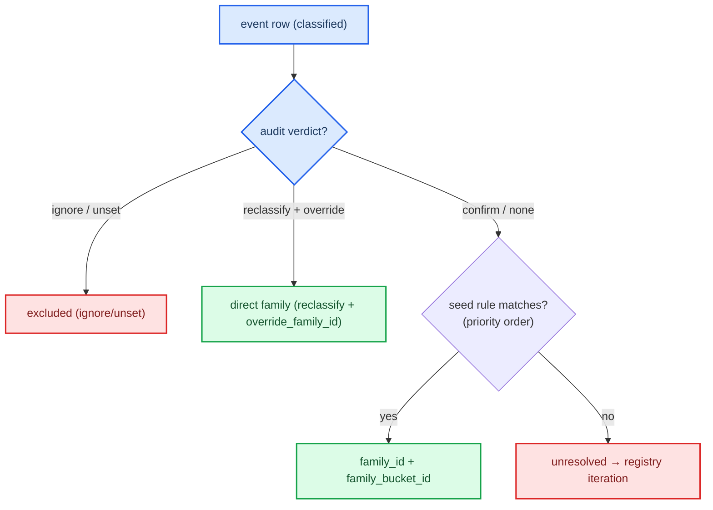

# FCC family registry

The curated FCC movement-family registry (`pylatkmc.ingest.families.FAMILY_REGISTRY`) is the
deterministic, audit-aware classification scheme that maps each pyKMC event to a **family** and an
environment **bucket**. It is the stable contract between the analysis classifier and the pylatkmc
rate table — independent of classifier internals, so the catalogue stays reproducible as the
classifier evolves.

Each `FCCFamily` carries: a `seed_rule` (predicate over the classifier's `motif_family_3d`,
`direction_family_3d`, `site_class_3d` columns), an `environment_rule` (buckets by vacancy/species
counts → `family_bucket_id` such as `nv1=2_nv2=0`), a `priority` (lower checked first), and a
`fit_barrier` flag (False families are visible in the export but excluded from rate fitting).

---

## 📚 The 15 families

13 are `fit_barrier = True` (rate-fit + HTST ν₀); 2 are visibility-only. Of the
13, two (`adatom_attachment`, `adatom_detachment`) are **adatom-gated** — rate-fit
in the catalogue but deliberately not translated into runtime Processes until the
lattice has above-surface adatom sites (`translator._ADATOM_GATED_FAMILIES`).

| Family | fit | Mechanism | ν₀ source (2026-06) |
| --- | :-: | --- | --- |
| `surface_1NN_inplane` | ✅ | ⟨110⟩ in-plane single-atom hop, vacancy at surface. **Dominant** (~39k events). | trajectory (per-bucket) |
| `subsurface_1NN_inplane` | ✅ | ⟨110⟩ in-plane hop, vacancy one layer down. | trajectory (per-bucket) |
| `bulk_1NN_inplane` | ✅ | ⟨110⟩ in-plane hop, bulk-like layer. **0 events** (vacancies never reach bulk). | canonical fallback (B) |
| `surface_2NN_diagonal` | ✅ | ⟨100⟩ in-plane face-diagonal hop, surface. | trajectory / canonical |
| `subsurface_2NN_diagonal` | ✅ | ⟨100⟩ diagonal hop, subsurface. | trajectory |
| `surface_interlayer_hop` | ✅ | ⟨111⟩ interlayer single-atom hop, mover at surface (~424 ev). | trajectory |
| `subsurface_interlayer_hop` | ✅ | ⟨111⟩ interlayer hop, mover at subsurface (~423 ev). | trajectory |
| `surface_subsurface_exchange_up` | ✅ | **2-atom concerted exchange**, +z. | trajectory |
| `surface_subsurface_exchange_down` | ✅ | 2-atom exchange, −z. | trajectory |
| `adatom_attachment` | ✅ | **Single-atom adatom re-insertion** into a surface vacancy (Δz ≈ −1.5 Å, coord 4→7). Renamed from `surface_subsurface_exchange_lateral` after the 2026-08-14 P2+P3 NiFe audit proved all 9,390 rows are 1-atom moves, not 2-atom exchanges. Adatom-gated at runtime. | trajectory |
| `adatom_detachment` | ✅ | Reverse leg (surface atom → adatom + vacancy, Ea 1.68–2.78 eV). 0 curated rows — excluded by the 1.2 eV barrier cap; declared so the exclusion is explicit. Adatom-gated at runtime. | — (no rows) |
| `subsurface_migration_axial` | ✅ | Subsurface vacancy migration, pure-z (rare, ~6 ev). | k0 fallback |
| `subsurface_migration_interlayer` | ✅ | Subsurface vacancy migration, ⟨111⟩ (~6.1k ev). | trajectory (partial) |
| `concerted_multisite` | ❌ | `n_moved ≥ 3`, no single-mover mechanism. | — (excluded) |
| `unresolved_multisite` | ❌ | complex / unresolved geometry; catch-all. | — (drives iteration) |

The 2-atom exchange + migration families are exactly the ones a hand-built canonical slab cannot
easily express — they get their ν₀ from `trajectory_recovery` (real concerted geometries). See
`CATALOGUE_SCHEMA.md` for the ν₀ provenance column and `docs/INGEST_PIPELINE.md` for the runbook.

> **2026-08 rename.** `surface_subsurface_exchange_lateral` → `adatom_attachment`
> (+ new `adatom_detachment`). Pre-rename catalogues and audit logs keep working:
> `family_by_id` resolves the legacy id via `LEGACY_FAMILY_ALIASES`, and the
> translator skips the legacy id silently alongside the new ids
> (`_ADATOM_GATED_FAMILIES`). `surface_subsurface_exchange_up`/`_down` were
> re-verified as genuine 2-atom exchanges and are unchanged.

---

## 🌳 Seed-rule precedence

Assignment order (`family_assignment.assign_events`):
1. Audit `ignore`/`unset` → **excluded**.
2. Audit `reclassify` + `override_family_id` → direct family (bypasses seed rules).
3. Audit `reclassify` + `override_move_type` → patch move-type, then seed.
4. Audit `confirm` or no audit → seed predicates in `priority` order.
5. No match → **unresolved** (collected into the iteration report).

---

## ➕ Adding / refining a family

1. Inspect the `unresolved` signatures in the assignment report
   (`family_assignment_report.json`, or `build_report`) — these are the geometries no family claims.
2. Add an `FCCFamily(...)` to `FAMILY_REGISTRY` with a `seed_rule` over `motif_family_3d` /
   `direction_family_3d` / `site_class_3d`, an `environment_rule` (bucketing), a `priority`, and
   `fit_barrier`. Keep `family_id` a stable snake_case identifier (it becomes the rate-table key and
   a pylatkmc Process-name prefix).
3. Re-run `pylatkmc.ingest.build_curated_catalogue` (assignment + rate table in one pass).
4. If the family should get an HTST ν₀, ensure its events are reachable by
   `trajectory_recovery` (per-bucket recovery), or add a canonical geometry in
   `htst.canonical_kappa._MOTIF_DISPLACEMENTS` (single-atom families only).
5. Validate against `tests/ingest/test_families.py` (registry invariants: unique ids, no seed-rule
   overlap on a synthetic frame).
