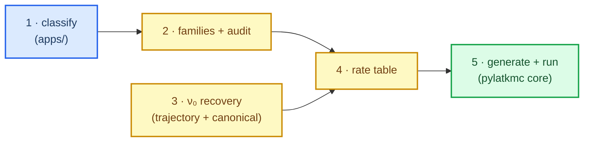

# Ingest pipeline runbook

End-to-end: from pyKMC simulation output to a compiled, HTST-rated pylatkmc model. All steps
live in `pylatkmc.ingest` (the moved bridge) except the classifier + audit UI, which stay in
`apps/PyKMC_Analysis`. Install the extra first:

```bash
pip install -e ".[ingest]"   # pandas, scipy, ase  (+ LAMMPS/pARTn/IRA/pyKMC on PATH for HTST)
```

See `CATALOGUE_SCHEMA.md` for every file's columns and `FAMILY_REGISTRY.md` for the families.

---

## 🔢 Stages



### 1 · Classify (analysis repo — stays in `apps/`)

Turn per-sim `reference_table.pickle` into `classified_events.csv`. Run the classification
notebook / parts in `apps/PyKMC_Analysis/Analysis/classify_lattice_events*`. Human audit (the Dash
`event_viewer`) writes `audit_log.csv`. *(Runtime: minutes; one-off per dataset.)*

### 2 · Families + audit · 4 · Rate table — one pass

```bash
python -m pylatkmc.ingest.build_curated_catalogue \
    --events  .../classified_events.csv \
    --audit   .../audit_log.csv \
    --out-events .../classified_events_with_families.csv \
    --out-rate   .../rate_lookup_table_family.csv \
    --prefactors-bucket .../family_prefactors_bucket.csv \
    --prefactors        .../family_prefactors.csv
```

Assigns families (audit-aware) and aggregates barriers per `(family_id, family_bucket_id)`, joining
ν₀ with **per-bucket → per-family → k0** precedence (`nu0_source` column records which). *(Seconds.)*

> Stage-by-stage equivalents remain: `python -m pylatkmc.ingest.family_assignment` then
> `python -m pylatkmc.ingest.build_family_rate_table`.

### 3 · ν₀ recovery (HTST — needs LAMMPS)

**Primary — from real trajectories** (per-bucket Vineyard ν₀ for every family with events,
including the 2-atom exchange/migration families):

```bash
python -m pylatkmc.ingest.cli recover \
    --rate-table .../rate_lookup_table_family.csv \
    --classified .../classified_events_with_families.csv \
    --T 500 --per-bucket 5 \
    --out-bucket   .../family_prefactors_bucket.csv \
    --out-family   .../family_prefactors.csv \
    --out-geometry .../recovery_audit.csv
    # --potential defaults to 'auto' (resolved per-sim from input.in: NiAlH / FeNiCr)
    # --families surface_1NN_inplane,...   to scope; --no-verify to skip firing-step provenance
```

Per geometry: catalogue cluster → frozen-boundary partial Hessian (`n_zero_modes = 0`, dx = 0.01,
auto-freeze gated to surface movers) → `vineyard_prefactor`. Gates (Ea, single imaginary mode,
1–50 THz range) drop bad geometries; the bucket median is written. *(Runtime: ~20 s/event, hundreds
of events — run in the background.)*

> **`python -m pylatkmc.ingest.cli` also serves the `EventClass` Parquet pipeline** (the Phase A/C
> identity layer, not this family-CSV runbook) with three pure subcommands (no LAMMPS):
>
> - **`build`** — the installed reference-table pipeline: project every row of a pyKMC
>   `reference_table.pickle` (robust global-orientation frame fit with the identity scale pinned to
>   `--nominal-a`/2; memo `PROJECTION_IDENTITY_REDESIGN_DECISION_2026-07-22.md` §3.1), enforce the
>   mover-keyed G3 (over-snapping memo 2026-07-29 §4–§5: a row with `FRAME_UNFIT` or a mover snap
>   residual ≥ `--mover-snap-tol` is dropped **before joining a class** into the sidecar ledger
>   `<out>_discarded.parquet` — counted, never silent; conservation
>   `n_rows = n_projected + n_raised + n_discarded`), mask static bystanders ≥
>   `--bystander-mask-tol` to `WILDCARD` (§6), run gates G1–G7, assemble + write the catalogue.
>   `--rcut` must be the pyKMC run's rcut (the G7 trap).
> - **`qc`** — the quality-control screens (reciprocity, delta-less, within-class dE-spread
>   **quarantine** per memo §3.5, human-veto overlay — sticky, orphans surfaced) re-emitting a
>   schema-v2 Parquet (`CATALOGUE_SCHEMA_VERSION` 1 → 2, `audit_reason` recorded). With
>   `--measured-refs` it also stamps each surviving class's ν₀ rate policy (memo §3.2–3.3):
>   previously-measured classes → `harvested_pair` (fire raw harvested pairs); recovered classes →
>   `pending_research` (excluded from measured procs by `translator_v2`, counted; their sites fall
>   through to the Phase C surrogate channel + flag registry until re-search).
> - **`graduate`** — the re-search agreement gate (memo §3.4): fold in-situ re-search barriers onto
>   `pending_research` classes; `|Ea_re-search − Ea_harvested| ≤ --band` (0.05 eV) graduates the
>   class (harvested pairs fire), above the band it is marked `CONTEXT_SUSPECT` and written to the
>   review list. Exclusions lift only through this documented gate, never silently.

#### Phase C E_sym surrogate — the feature basis (v2, 2026-08-15)

The optional `[rate_data].surrogate_model` (`esym_model.json`, fit by
`pylatkmc.ingest.surrogate.fit_esym_model`) is baked into `proclist.c` and re-implemented
verbatim in `runtime/src/core/surrogate.c`. Its feature basis is a **closed 115-key** one-hot
alphabet over six categories — `C` (Cr), `E` (empty), `F` (Fe), `N` (Ni), `U` (OUTSIDE) and
`W` (WILDCARD / OCC_ANY, i.e. occupied-but-masked):

| group | count | keys |
|---|---|---|
| scalars | 6 | `abs_delta_atoms`, `depth_param`, `depth_surface`, `n_delta`, `mover_n_C`, `mover_n_F` |
| shells | 60 | `s{0..9}_{C,E,F,N,U,W}` |
| 1NN bonds | 10 | unordered pairs over `{C,E,F,N}` — `U`/`W` never bond |
| mover-neighbour | 18 | `mv{C,F,N}_{C,E,F,N,U,W}` |
| triangles | 21 | unordered pairs over all six categories |

Three things bite:

- **`W` is structurally `U` but is its own label.** It is excluded wherever `U` is excluded
  (bonds, being a mover) yet counted separately in shells / mover-neighbours / triangles, so
  "occupied by something we can't name" never reads as "can't see it". `W` is **harvest-side
  only** — the C runtime can never produce it, and the OOD trigger deliberately carries **no**
  `W` range (a `W` floor would flag every candidate forever). The mild train/serve deflation
  this causes in the `N/C/E/F` counts errs toward *over*-flagging.
- **ΔE_H is untrained for Fe and `W`.** `H2FEATS` (18 features) is frozen at the external
  2026-07-21 H(σ) campaign and has no Fe / wildcard terms, so an `F` or `W` category
  contributes exactly zero to ΔΦ on both the Python and the C side. An all-NiCr fit bakes the
  Fe context range as `[0, 0]`, so every runtime Fe context trips `SURR_TRIG_SPECIES` and
  lands on the priority re-search `flag_registry.csv`. That gate is what makes the untrained
  ΔE acceptable — do not widen it without an Fe-bearing corpus.
- **The basis is closed, not corpus-measured.** A future NiFe catalogue stamps against it
  without tripping `phi_vector`'s unknown-key guard (which stays: a key outside the closed set
  is a real bug). But a **pre-v2 68-key `esym_model.json` can no longer be baked** —
  `emit_surrogate_tables` asserts `len(mu) == len(ESYM_FEATURE_KEYS)`. Refit, then regenerate
  every model that names a surrogate model; a stale committed `generated/proclist.c` will not
  even compile against the new `surrogate.h`.

**Fallback — canonical slabs** for zero/low-event families (e.g. `bulk_1NN_inplane`):

```bash
python -m pylatkmc.ingest.htst.canonical_kappa --all-families \
    --out-csv .../family_prefactors.csv --T 500
```

After (3), re-run (4) so the new ν₀ lands in `rate_lookup_table_family.csv`.

### 5 · Generate + run (pylatkmc core — no ingest deps)

```bash
pylatkmc-gen build  models/<model>/<model>.kmcspec.toml      # spec + rate table → proclist.{c,h}
pylatkmc-gen provenance models/<model>/<model>.kmcspec.toml  # ν₀ coverage report (htst vs k0)
cmake -B build -DMODEL=<model> && cmake --build build         # → build/pylatkmc_<model>
mpirun -n 1 build/pylatkmc_<model> input.ini                  # runtime-T: any physics.temperature_K
```

Set `prefactor_style = "htst"` in the spec's `[rate_data]` to use the recovered ν₀; `"constant"`
uses the global `k0`. Rates are computed at the **runtime** temperature (one binary, any T).

---

## ✅ Sanity checks

- **Coverage:** `pylatkmc-gen provenance` (or the `nu0_source` column) should show which families are
  `trajectory_bucket` / `family` / `k0`.
- **Cross-validation:** recovered surface_1NN `nv1=0_nv2=1` ν₀ ≈ canonical 13.13 THz; all ν₀ in the
  5–30 THz FCC-Ni band (flagged otherwise).
- **Full-system boundary check** (`tools/htst_fullsystem_xcheck.py`): for events that fired
  on-cadence, the 128-atom cluster-direct ν₀ agrees with the full-slab-boundary ν₀ to **9–16 %**
  (ratio 1.09–1.16, IRA alignment RMSD ~0.00 Å) — confirming the cluster frozen boundary is
  adequate, so cluster-direct recovery is trustworthy.
- **Idempotency:** re-running `recover` upserts the same `(family, bucket, T)` rows.
- **Tests:** `pytest tests/ingest` (49 fast + 1 LAMMPS-backed Hessian test).

## ⚠️ Gotchas

- Some alloy sims have **empty `pykmc.out`** (incomplete runs) — cluster-direct ν₀ is unaffected;
  only the firing-step *provenance* is skipped.
- ν₀ is **strongly bucket-dependent** (surface_1NN: 4.7→26.9 THz with vacancy count) — prefer the
  per-bucket join over a family median.
- `representative_row_indices` are **positional `.iloc[]` indices** into
  `classified_events_with_families.csv`, not `idx_ref`.
- The legacy `fix_catalogue_nvac.py` n_vac post-patch is being retired by an upstream classifier
  fix; until then, the committed rate table reflects the patched bucketing.
